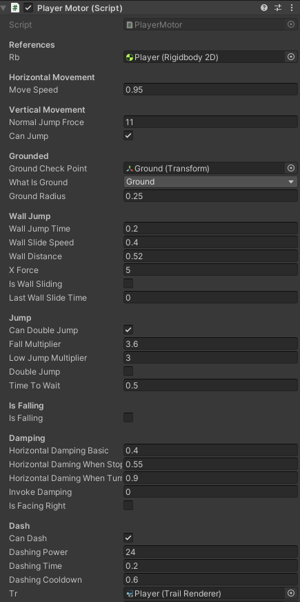

# Unity-2DPlayerMotor.cs

Welcome to my Controller Script! 
This project provides a simple and customizable character controller for 2D games.
Whether you're making a platformer, action-adventure game, or any other type of 2D game, this controller can help you get started quickly.

The character controller is designed to be easy to use and modify to fit your game's needs. 
Here is a simple list of its core features:

 - Horizontal Movement
 - (double) Jumping 
 - Jump buffer time (coyote time)
 - Wall sliding/Jumping
 - Dashing
 - Ground detection
 - Acceleration

***I also included example-code(as comments) to animate the Players movement but this is not final and not yet fully functional***

To get started, simply clone or download the Code [Found here](PlayerMotor.cs) Then, add the controller script to your player character object and customize the settings to fit your game's requirements. The Standard Settings (My Personal Preference [Can be found here](Settings.txt)).  
(**Note**:  a quick simplification of what the different variables do, can be found [here](CodeInfo.md))

Once you are finished experimenting with the values, you should have something looking like this:

I hope you find this character controller useful in your game development journey. 
Happy coding!

# Quick Start

 1. Add the Script to your Player Character 
 2. Following Components are essential in order to use the Script properly:
 - RigidBody2D
 - BoxCollider2D
 - Empty GameObject placed at the players feet (The 'GroundCheckPoint')
 
 3. These Contents are Optional:
 - TrailRenderer 
 - Animator 

4. To your Ground Plane in the Scene add a new Layer "Ground" (or something like that)
5. Select the Ground layer at the 'What Is Ground' menu and select the 'Ground Check Point'
6. Adjust the 'Ground Radius' if needed
7. Have Fun!

# Stay updated 

As Im still working at this Piece of code you might want to check this GitHub Page to always be up-to-date. 

# Donation

If you like my Work and want to support me you can **Donate** me, I appreciate every penny.

 
